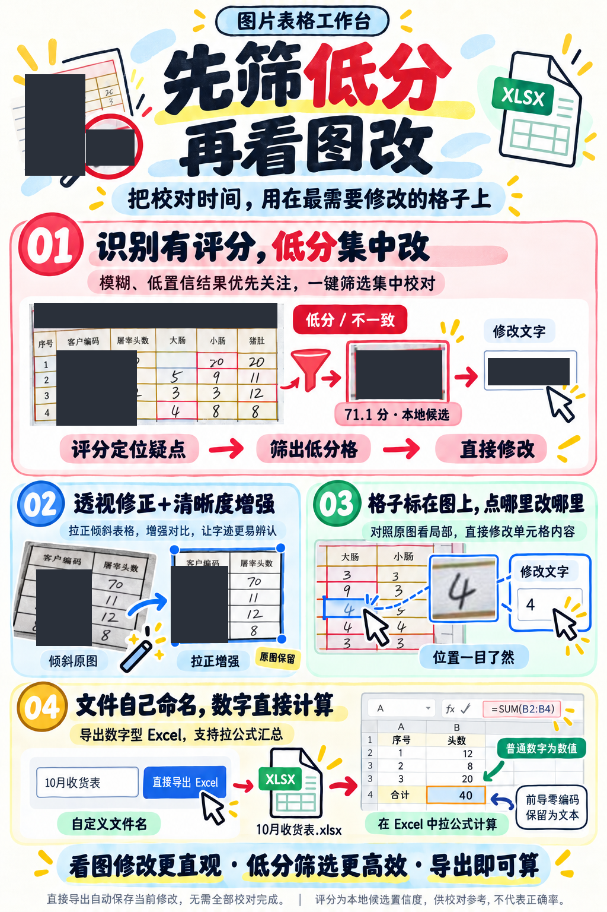
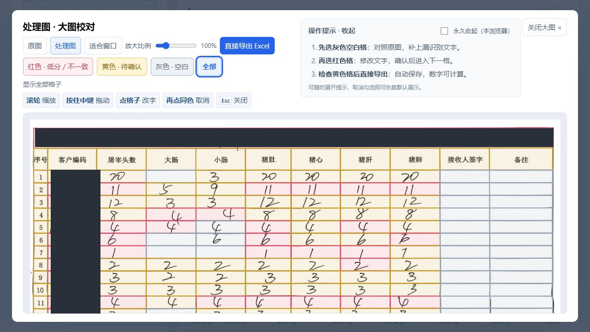
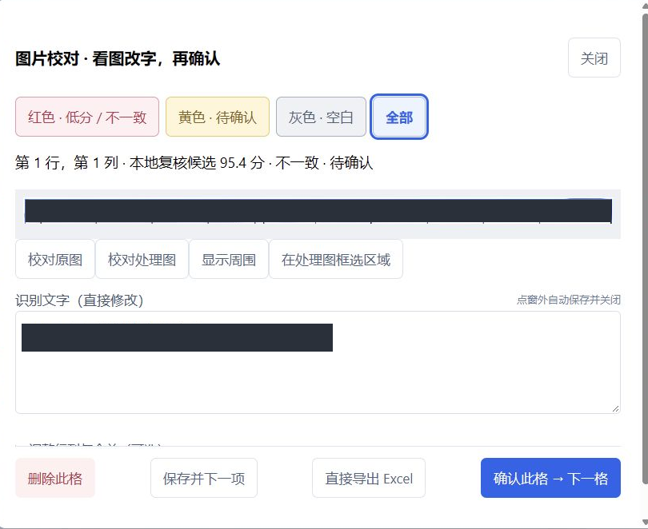
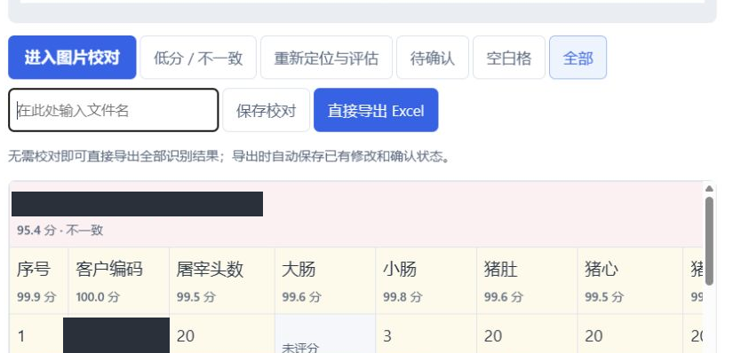

<div align="center">
**简体中文** | [English](./README.en.md)



<h1>图片转excel工具</h1>
<b>Windows · 扫描全能王接入 · 看图校对 · 可计算 Excel</b><br>
先筛低分，再看图改，把校对时间用在最需要修改的格子上。


</div>

这是一款运行在本机浏览器中的图片表格识别与校对工具。使用扫描全能王官方 CLI 完成云识别和 AI 增强，用本地 OCR 候选评分定位需要优先检查的格子，最终导出可计算的 Excel。

公开源码、截图和发行包均已排除作者登录凭据及历史数据；真实截图中的业务名称、客户标识等已遮盖。海报为 AI 生成的功能图解，下面的三张截图来自实际运行界面。

> ⚠️ 云识别和 AI 增强需要登录**自己的账号**并联网，可能消耗官方服务额度。评分是本地候选置信度，**不代表正确率**。

## 🎬 运行截图


<br><sub>真实界面：图片叠加单元格轮廓，用颜色筛选疑点；敏感名称已遮盖。</sub>


<br><sub>真实界面：查看单格局部原图、参考本地候选评分并修改文字；点击窗外自动保存关闭。</sub>


<br><sub>真实界面：自定义文件名后直接导出，已修改内容自动保存；未确认格子也能导出。</sub>

## 📥 下载安装

在 [Releases](https://github.com/gdSHAY/image-to-excel-tool/releases/latest) 下载 `image-to-excel-tool-v1.0.0-win-x64.zip`，约 128 MB。

1. 完整解压到可写文件夹，双击 **图片表格工作台.exe**。
2. 在顶部 **配置** 中登录自己的扫描全能王账号。
3. 选图、上传识别，按需校对后导出。运行环境和本地模型随包提供，无需另装 Python、Node.js。

保留 `runtime/`、`node_modules/`、`web/` 等目录，不要只复制 EXE。关闭网页不会停止服务；可在启动器中点击“停止工具”。

### 从源码运行

准备 Windows x64、Python 3.13 和 Node.js，然后运行：

```powershell
git clone https://github.com/gdSHAY/image-to-excel-tool.git
cd image-to-excel-tool
powershell -ExecutionPolicy Bypass -File .\setup.ps1
.\start.cmd
```

服务地址为 `http://127.0.0.1:8788/`。可用 `build-launcher.ps1` 编译 Windows 启动器。

## ✨ 四个核心特点

| 特点 | 使用效果 |
| --- | --- |
| 识别有评分，低分集中改 | 本地候选评分与一致性检查标出疑点，一键筛选红色格子并集中修改 |
| 透视修正＋清晰度增强 | 本地平面透视校正、手选四角、对比增强；扫描全能王提供官方 AI 超级滤镜 |
| 格子标在图上，点哪里改哪里 | 原图/处理图叠加定位框，点击进入局部图校对；滚轮缩放、中键拖动 |
| 文件自己命名，数字直接计算 | 自定义导出文件名；普通整数、小数以数值导出，方便在 Excel 中拉公式 |

前导零编码、长标识符、文字和表达式仍按字面文本保留。第一张工作表为识别表格，第二张只放原图；不自动生成公式。

## ⚙️ 三步开始用

1. **配置并识别**：默认自动透视拉正、自然增强、扫描全能王、AI 超级滤镜；选择图片后显示缩略图，识别结束自动切到处理图和大图校对。
2. **按颜色校对**：先查灰色空白格是否漏识别，再筛红色低分/不一致，最后看黄色待确认。再次点击同色取消筛选，“下一项”在当前筛选集合中切换。点击“框选补格”，左键拖动出现实时紫框；右键或 Esc 退出框选。
3. **命名并导出**：修改弹窗点窗外自动保存关闭，可切换“保存不标记”或“保存后变绿”。输入文件名直接导出，无需先保存校对，也无需全部确认。绿色代表人工已确认。操作提示可永久收起；历史记录可展开、打开、删除与撤销。

## ⚠️ 能力边界与前提条件

- 目前验收平台是 Windows 10/11 x64；其他操作系统未验证。
- 扫描全能王登录态、额度和服务可用性由供应商决定；公开包不含任何共享账号。
- 本地评分来自 RapidOCR / PP-OCRv6 候选，不是扫描全能王官方评分，也不是识别正确率。空白格可无分数。
- 原图保留，处理图另存；图片只在主动调用云服务时发送到对应供应商。任务与登录态保存在本机 `data/`。
- 当前本地自动拉正为 OpenCV 平面透视处理，不是纸张曲面展平模型；弯曲纸张、折痕和复杂手写仍需核对。
- 本地候选坐标与原图配准不可靠时，需要人工框选绑定；标题、数字、行列、合并和备注都建议检查。
- TextIn 为可选服务，需要自己的凭据；当前公开说明不宣称它已通过真实调用验收。

## 🧱 技术栈

FastAPI、原生 HTML/JavaScript、OpenCV、RapidOCR / PP-OCRv6、ONNX Runtime、Pillow、openpyxl、扫描全能王官方 CLI，以及 Windows .NET/WinForms 启动器。

参考组件：[RapidOCR](https://github.com/RapidAI/RapidOCR)、[PaddleOCR](https://github.com/PaddlePaddle/PaddleOCR)、[扫描全能王接入文档](https://v4.camscanner.com/agent-docs/zh/platforms/for-agents/cli/)。

## 🗂 项目结构

```text
app.py              本机 API 与任务流程
imaging.py          透视处理、定位、原图坐标映射
assessment.py       本地候选复核与评分
providers.py        官方服务和登录集成
tables.py           单元格结构与 Excel 导出
web/                上传、筛选、看图校对界面
launcher/           Windows 启动器源码
tests/              离线功能回归
docs/               脱敏海报和真实截图
```

## 🔌 REST API

默认仅供本机界面使用，不建议直接暴露到公网。

| 方法 | 路径 | 用途 |
| --- | --- | --- |
| GET | `/api/health` | 健康检查 |
| GET / POST | `/api/jobs` | 历史列表 / 上传图片 |
| GET / PUT / DELETE | `/api/jobs/{id}` | 读取 / 保存校对 / 可恢复删除 |
| POST | `/api/jobs/{id}/recognize` | 调用所选服务识别 |
| POST | `/api/jobs/{id}/assess` | 本地评分复核 |
| POST | `/api/jobs/{id}/warp` | 手选四角拉正 |
| GET | `/api/jobs/{id}/image/{kind}` | 原图或处理图 |
| GET | `/api/jobs/{id}/excel` | 下载 Excel |
| GET | `/api/auth/status` | 登录状态 |
| POST | `/api/auth/login` | 获取官方授权入口 |

## ❓ 常见问题

<details><summary>必须把所有格子都校对完才能导出吗？</summary>
不用。直接导出会保存当前修改，未确认格子保留当前识别内容，不自动标记为已确认。
</details>

<details><summary>为什么有些格子没分数，或者高分也会错？</summary>
只有得到有效本地候选的格子才有参考评分。置信度不等于正确率；空白、漏识别和复杂字迹都要看原图。
</details>

<details><summary>数字能直接参与 Excel 公式吗？</summary>
普通数字以数值导出，可以在 Excel 中自行输入或拖动公式。前导零编码和公式样式的识别文本不会被执行。
</details>

## 📄 合规与免责

请仅上传拥有处理权限的材料。素材著作权归其权利人；无授权的测试素材请于 24 小时内删除。项目供个人学习研究使用，识别结果需人工复核，使用者自行承担相关风险。云端服务与第三方组件遵循各自条款和许可证；本项目与供应商无官方隶属关系。

## 📮 联系

通过 [GitHub Issues](https://github.com/gdSHAY/image-to-excel-tool/issues) 反馈。请勿提交账号密钥、登录凭据、原始敏感图片或未经脱敏的任务文件。

## ⭐ Star 历史

[查看 Star History](https://star-history.com/#gdSHAY/image-to-excel-tool&Date)。

## 📄 许可

当前未授予开放源代码许可证，作者保留权利；见 [LICENSE](./LICENSE)。第三方依赖适用其各自许可证。

<div align="center"><sub>README 可切换中文与英文；软件界面当前为中文。</sub></div>
